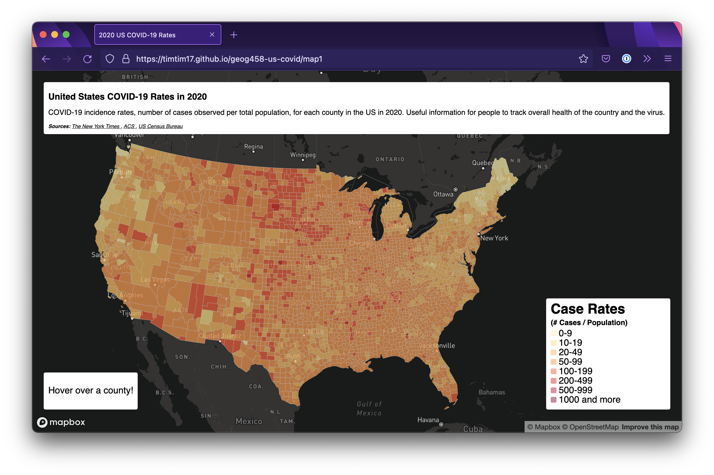
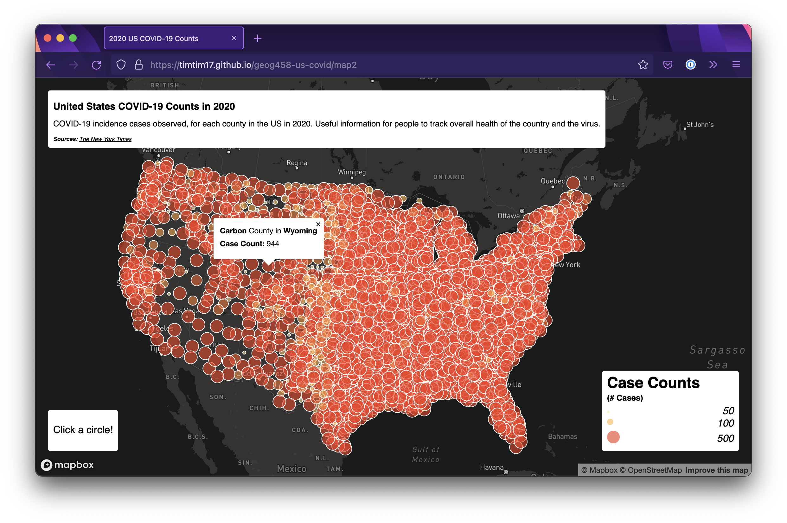

# 2020 United States COVID-19 Maps

This project briefly explores the trends of COVID-19 by county in the United States in 2020. We can
look at overall case counts in each county, and the overall rate of cases per population.

Built with the [Mapbox](https://docs.mapbox.com/mapbox-gl-js/api/) library using data from:

- [The New York Times](https://github.com/nytimes/covid-19-data/blob/43d32dde2f87bd4dafbb7d23f5d9e878124018b8/live/us-counties.csv)
- [ACS](https://data.census.gov/cedsci/table?g=0100000US%24050000&d=ACS%205-Year%20Estimates%20Data%20Profiles&tid=ACSDP5Y2018.DP05&hidePreview=true)
- [The US Census Bureau](https://www.census.gov/geographies/mapping-files/time-series/geo/carto-boundary-file.html)

https://timtim17.github.io/geog458-us-covid/map1

https://timtim17.github.io/geog458-us-covid/map2

On the choropleth map, a user can hover over each individual county to see more information about it.
On the proportional symbols map, a user can click on each symbol to see information about that
county.
